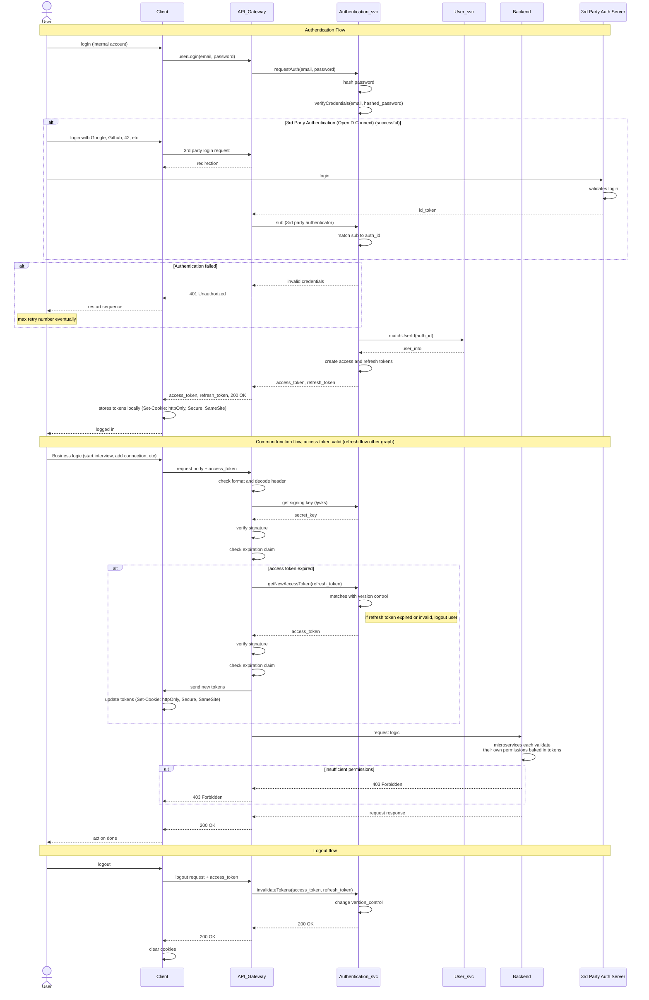

# UML Syntax
### Actors
interact with the system and its objects
### synchronous calls
full arrow one way and dotted line other way for response
### asynchronous calls
full arrow one way

## Auth flow

